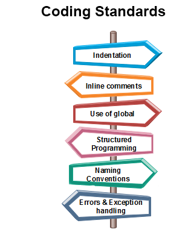
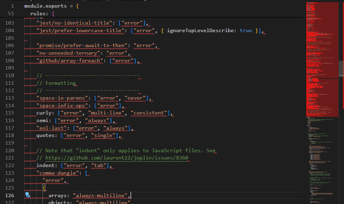

# What Are Coding Standards?

Coding standards are a concept that every single programmer will encounter at one point in their career. They’re essentially “guidelines” on how code should be formatted in order to achieve consistent and readable code. Every group, professor, company, and whatnot may set different coding standards to follow. But, variations in coding standards doesn’t shy away from its main purpose of maintaining code.

To help understand this concept more, imagine working in a group coding project with no coding standards. One person may not indent code nested within another while another might. Furthermore, someone could place the closing-curly brace on the same line as the last line of code while someone else could put it in the next line. Now, imagine all these people combining their code together. It will definitely look like a hot mess! 

 
 
# Starting Out With the Standards

My first experience with coding standards was when I took ICS111, the first introductory class to object-oriented programming (done with Java), at Leeward Community College. On top of learning Java, following coding standards was quite tedious, especially since it was a part of our grade with programming assignments! To exemplify how bad it was for me, coding standards were what was killing my grade for the class. 

Despite what appears to be a negative experience, I’m really grateful that I had to learn it and that it was enforced on us. Like mentioned earlier, it really did make my code look cleaner and the debugging process wasn’t as dreadful since I could easily read through all my lines of code.

From what I learned from ICS111, I built a habit of following coding standards whenever they were set. It was not enforced in ICS211 (the “second part” of ICS111), yet I followed coding standards from ICS111 to remain consistent. During ICS212, programing in C and C++, they were once again enforced. Of course, my past experiences were able to help me remain consistent with following standards during ICS212. 

  

 
# The Dreaded Redline

Now that I am taking ICS314 (a software engineering course), I am once again facing coding standards. This time around, it is definitely different due to using Visual Studio Code, an integrated development environment that allows extensions to modify the coding workspace. 

Specifically, we’re using ESLint to actually enforce the coding standards, whereas previous IDEs did not have a strict enforcement. In other words, writing code that did not follow said standards would result in an error. 

Like my initial experiences with coding standards, I also find this to be tedious mainly because of it actually resulting in an error. Also, seeing a multitude of red lines can be an eye-sore! Besides that, I know that this is very helpful because it keeps the code organized. Later on in the course when we begin the group project, this will especially come in handy because having multiple collaborators is bound to cause disorganization without coding standards.

 

# Conclusion

Overall, it’s important to think about having coding standards in place because it enforces consistency with writing code. Without coding standards, your code could potentially be difficult to read which then results in difficulties with modifying and/or bug fixing. Moreover, these guidelines are essential when it comes to working in groups as collaborators can produce code in a standardized format instead of varying, individual styles.
