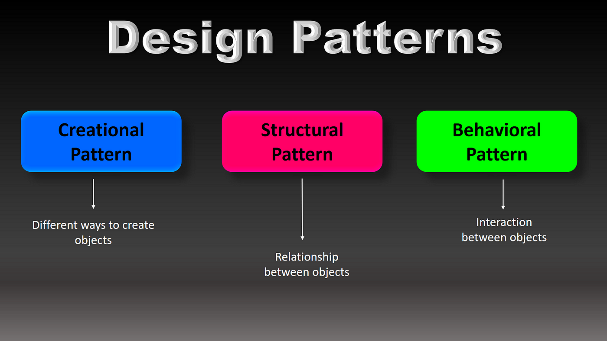

# Opening the Toolkit

Across every aspect of the real world, problems exists and most have solutions to these problems. Oftentimes, some problems may appear frequently with the same specifications. As such, we can deduce “patterns” and create a reusable solution(s) to solve said problem. 

Let’s take building the infrastructure for a house for an example. The problem is what should the infrastructure be like given that the climate will be cold and experiences a lot of snow (maybe somewhere like Alaska!). A design pattern when it comes to the type of material to use are ones that are good with heat insulation to keep the house warm within cold climates, for example using fiberglass with insulation.

Well given that real life example, how is this relevant to software engineering?

When creating and designing software, there are obviously “problems,” or more specifically, specifications for a software to achieve a certain task. Some problems may overlap or happen frequently, hence why the proposition of design patterns to help approach these problems and implement solutions are so important! 

To further help visualize this, envision design patterns as “tools” that are part of a toolkit and ultimately help build a solution. Similarly to how in real life, tools used in construction ultimately contribute in building something (like a saw to cut wood, a hammer to pound nails in to hold something in place).

 
 
# So Many Tools to Choose From!

As one may expect, there are a bunch of software engineering design patterns! They are also categorized to help represent what type of problem they’re meant to solve. These include creational patterns that involve creating objects (essentially an entity with a state, behavior, or overall purpose), structural patterns that organize and set relationships between objects, and behavioral patterns that “facilitate” communication between objects.

  

With so many design patterns, I’ll personally talk about a few I’ve used throughout my time as a computer science major.

An example are iterators! They’re a type of behavioral design pattern that allows you to access elements of an object sequentially (think like “looping” through an array) without revealing its representation. They’re commonly used in traversing and accessing the elements of a data structure. I’ve used these a lot in ICS211 (the second introductory class to computer science with Java as the language of instruction) when having to iterate through some data structures such as linked lists or stacks. 

Besides iterators, I’ve also used the null object pattern, which is another type of behavioral pattern design. Put simply, this design pattern focuses on handling a null value by representing it was another object, which simplifies code because it does not need to check for nulls. I’ve used this frequently in my ICS311 (Algorithms) class, where some abstract data types that normally required a null check could be handled using a different representation. For instance, representing a non-existent index in an array or a non-existing child of a node with the value of -1. 

Overall, these are some examples of ways I’ve used design patterns and there are clearly much more! They are meant to streamline the way software engineers approach problems or tasks regarding their software. As such, being able to know the different kinds and discern when to use each one is an important asset for a software engineer to have.

