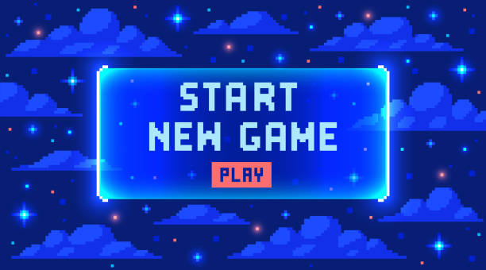

# Press Start
This game of getting into software engineering started when I was younger: from the computer in the corner of my family’s room all the way back in the Philippines. I was introduced to computers at such a young age and my curious mind wondered: how does this work? Why does this happen when I press this? These thoughts and imaginations scurried throughout my brain. In addition, my father introduced me to video games on the computer. To name a few, he showed me Counter Strike and a collection of web games available through Facebook. This world of video games sparked something in me. I was so enamored by the fantasies they represented and how things functioned. Even after moving to Hawaii in 2012, this passion and joy remained. Before I knew it, I became attached to computers and video games.

# The Game Continues
This all culminates into my interest in the field of computer science as a whole. I knew then I wanted to work with computers or technology in any shape or form, specifically making programs. As such, software engineering became an interest of mine. The process of designing and being bound only by your creativity was something that truly piqued my curiosity. 

I aim to hone my skills in programming throughout the different ICS courses as well as extracurriculars available. For instance, through this class, I hope to gain a better understanding of building websites and/or apps with databases such as PostgreSQL and designing UI with React.js. The most experience I have with building websites are simple sites with HTML, CSS, and a little JavaScript which I did over high school. Having the opportunity to go beyond what I know through this course is quite an exciting opportunity. Outside of this class, I would also like to get into game design (I mean it only makes sense since it's the reason I chose this path in the first place, right?). I've had some experience with Unity and C# through GameDev during the Fall 2024 semester and I'm planning on commiting to more projects with them!

# Which Path Will You Take?
My future with software engineering is not set in stone yet so I’d like to take my time in this “game” to explore this vast field of computer science. Many paths come to mind such as video game development and even cybersecurity. This past year, I’ve gotten really fixated on eSports (specifically League of Legends) and I want to see how I can take software engineering or computer science into this industry. These are just some things I envision for my future and hopefully I can confidently continue this game after graduation.
