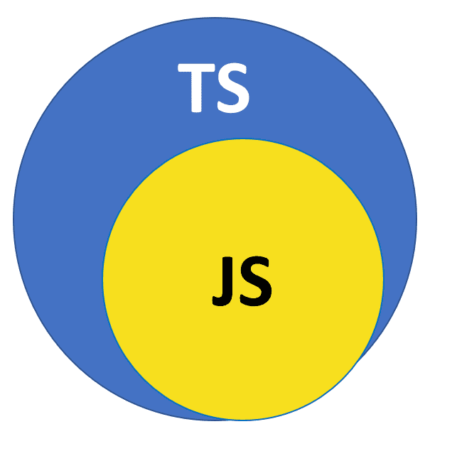
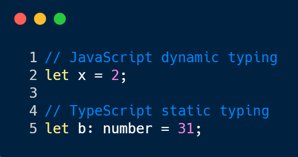

# First Impressions

Through the first module of ICS314, I had the opportunity to review JavaScript and learn TypeScript. Though similar in name, both are actually quite different. TypeScript is a programming language, a superset of JavaScript, developed by Microsoft in 2012. And for that, I must say: THANK YOU MICROSOFT! 

Having experience in other programming languages like Java, C, and C++ who are type-based, I was immediately attracted by TypeScript. While reviewing JavaScript, one of my biggest complaints was how unorganized it was since the variables were not bound by types. Not to be overdramatic but it kind of made me feel weird. What do you mean I can have an array with a string, number, and boolean?! The lack of bounds to a particular type was just something I’m not used to as I’ve had a lot of time with type-based languages.

TypeScript, though still having the option for dynamic types, alleviates the issue with the addition of static types. With static types, I felt as if I could code with more organization since I could declare what type the variable holds: either a string, number, boolean, etc. This ties in with another feature I liked which are union types that allow a variable to hold different types. So, you could declare a variable to either hold a string or number. It's similar to dynamic typing except with the addition of bounds. As such, the flexibility and organization that TypeScript has over JavaScript makes it my “type.”

# Encounters With TypeScript

Outside of learning TypeScript, I’ve already had a chance to interact with it through assignments. In particular, I’ve done three different practice Workout of the Days (coding challenges) with the use of TypeScript. While I was doing it, I must admit, I had some trouble with the syntax. This is something I definitely need to look back on and commit time to practice, practice, practice! Aside from that, I felt “comfortable” doing it, thanks to static typing making my code more readable.

In the future, I hope to become more proficient with TypeScript with our many “encounters.” I am aiming to do projects of all sorts but having TypeScript in my arsenal for web frameworks is going to be a valuable asset. Moreover, I am not sure where I will be career-wise so picking up any technical skills along the way is just a great thing to do. Overall, if you're thinking of picking up any programming language or technical skills in general, I highly recommend TypeScript. Of course, start with JavaScript as it is the foundation but eventually move on to TypeScript and it will make things so much easier!
