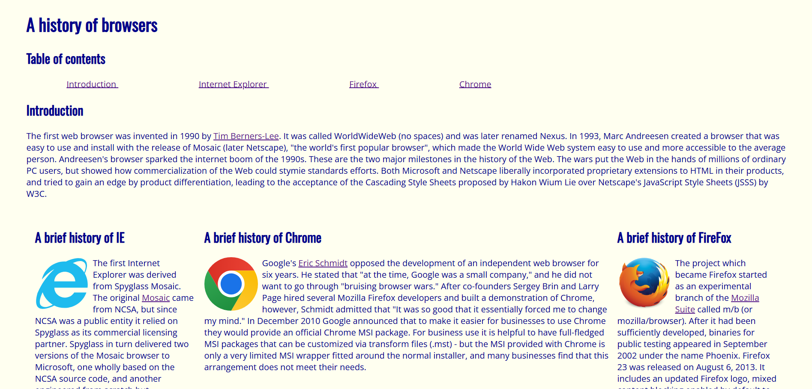
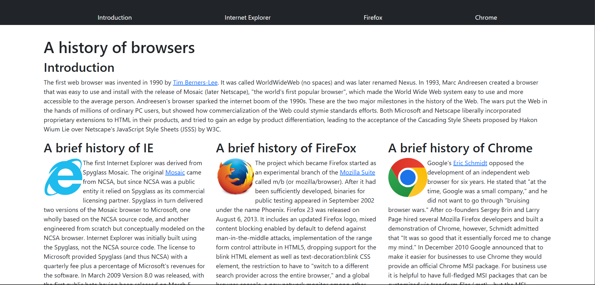

# Challenges in Web Design
Building websites involve two primary components. The first is developing the back-end which focuses on the functionality and processes of the website. Whereas the second component, the front-end, is centered around the visuals and design of the website for users to see. As the back-end may seem more in-line with programming for the purpose of functionality, software engineers may find it a challenge to actually design a site in a way to captivate users while giving a satisfying experience.

# The Power of UI Frameworks
For that reason, the usage of UI frameworks (such as Bootstrap 5) become relevant in designing websites in a simpler way. But, what are UI frameworks? First let’s break down the words:

UI, or user interface, is simply the medium that allows users to interact with a computer, application, etc. Meanwhile, frameworks (in the context of programming) provide a foundation for developing software, be it pre-written code that can be modified or functions that automate a task. Combined together, UI frameworks refer to a collection of pre-built, web design components that are pre-written in HTML, CSS, and/or JavaScript which are the primary languages to build a website.

As such, these frameworks streamline and accelerate web design by providing programmers with already pre-written code to work with. As a result, programmers may opt to utilize UI frameworks as opposed to raw HTML and CSS due to the added complexity of formatting components by hand. 

From my personal experience, I found using UI frameworks to be easier than raw HTML and CSS. With raw HTML and CSS, I often found myself running through hoops just to get a specific design whereas I could just call a couple of specific classes with Bootstrap 5 to get the same result. I’d say the only “difficult” thing about utilizing UI frameworks is finding the right classes to use, but then again, finding the right things to use is something everyone encounters when learning a new programming language. I believe that this problem will resolve itself as I use it more.

 

# Examples of HTML/CSS vs Bootstrap 5

As mentioned earlier, the advantage Bootstrap 5 has over raw HTML/CSS is its simplification of design. A particular example of this is the “Browserhistory” practice that we worked on. 

When using only HTML/CSS to do this WOD, one of the biggest challenges I had was formatting the columns and table of contents/navigation. I often had to “brute force” the spacing, as in I constantly changed the numbers around until I got it to a similar result. Moreover, notice the columns of the paragraphs in the “Browserhistory” with HTML/CSS. They look uneven and only look uniform if you minimize the screen.

   
On the other hand, rebuilding this same site with Bootstrap 5 was amazing! The classes to create a navigation bar at the top meant that I did not have to “brute force” the spacing as it was already done by the classes. To add on, Bootstrap 5 allows simpler design of columns with classes “row” and “col” to designate the positioning of the columns. See below how the columns look more uniform than the one with raw HTML/CSS? That is the power of Bootstrap 5 coming to fruition!

# Conclusion
Overall, Bootstrap 5’s capabilities of designing websites in a simpler manner puts it above designing with raw HTML/CSS. The learning curve that comes with Bootstrap 5 is definitely worth the time and effort when it comes to being a better web designer. As such, learning UI frameworks is a valuable asset in streamlining web design.

