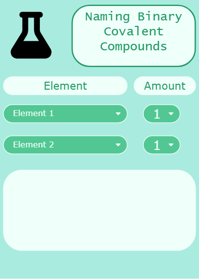

  

### Overview 

UH Manoa students may have a difficult time finding internship and job opportunities being offered. Oftentimes, they must rely on company visits (such as career fairs or seminars) or waiting for an announcement to be sent out. But, these sources may not always be reliable to a student. For example, announcements may not reach students or a student may not be able to attend a company visit due to time. As such, Project Janus was created to streamline the connection between students and companies.

In the app, companies are able to create accounts and curate their profile to give students (and other companies) more information about them. Moreover, companies are able to add job offers to their listings for everyone to see. On a student account, they can browse to research companies and find job opportunities.

This application was done as a final project for ICS 314 in the Spring 2025 semester. To build this project, we also used a Next.js application template, which can be found [here](https://github.com/ics-software-engineering/nextjs-application-template)!

### Contributions

I was the primary back-end developer of the project so I worked on implementing most of the functionality of the site. Here are a list of some of the tasks I completed:

<ul>
  <li>Modeled how to create a student and a company account through the User model in Prisma</li>
    <ul>
      <li>Using the models, I created separate sign up pages for users to create either a student or company account</li>
    </ul>
  <li>Modeled the jobs associated with a particular company in Prisma</li>
  <li>Added functionality to create and edit student user's profile page.</li>
    <ul>
      <li>Students could update their personal information, such as major, interests, description, link to portfolio, preferred location</li>
    </ul>
  <li>Added functionality to create and edit company user's profile page.</li>
    <ul>
      <li>Copmanies could update their description, logo, and preferred location</li>
      <li>Using the job models, I also implemented a way for companies to add jobs to their job listings and edit ones already listed in their profile.</li>
    </ul>
  <li>Assisted with mapping all existing company accounts onto the browsing page.</li>
    <ul>
      <li>Linked each company listed onto their respective company profile. I used separate components to prevent other users from editing the particular company's profile.</li>
    </ul>
</ul>

Aside from my back-end work, I also took on the role of project manager. I helped delegate tasks and keep everyone up to date with changes being made to the application. I also frequently checked up on the progress my teammates made to ensure tasks were being completed and assissted them with their tasks if requested. On top of that, I helped fix majority of the bugs/issues on our app. Most of these involved bugs that prevented our app from being deployed globally on Vercel. For example, certain function calls prevented the deployment as they were either outdated (as in it was calling values that didn't exist) or they weren't called at all. 

### Lessons Learned and Possible Updates

This project was the first time I've ever worked on creating a deployed, web application. I was able to experience putting what I learned throughout ICS 314 into this project, including using user interface frameworks to design a page, creating and querying from a database, and debugging programs. Aside from applying technical skills, I also applied soft skills involving communication and collaborating with a team through issue driven project management (IDPM). Overall, this project was a valuable experience because of the fundamanetals of software engineering we were able to practice. Using the lessons I learned, I could apply this in future software-related projects or if I get a career in software development.

Of course, I feel like this project isn't fully fleshed out. I'd like to go beyond what's implemented such as adding a formal way of connecting students with companies (or even students with one another) and vice versa. I'd also like to create a better interface for the application as it looks a bit too simple and draws similarity from the initial template we used. I plan on working this developing project individually in the near future, possibly during the summer or the upcoming fall 2025 semester.

### Links

The project was deployed via Vercel, a web hosting service company. The link to view it can be found here: [Project Janus](https://project-janus.vercel.app/)
 
<em>NOTICE: Vercel "pauses" deployed sites that have been inactive for more than 7 days. If kept paused for more than 90 days, the deployment is deleted. If you are trying to access the site but are unable to, this might be due to Vercel un-deploying the site. Contact to the Project Janus team can be found in the project site linked below. </em>

To see more information about the project, visit our project site here: [About Project Janus](https://project-janus-3.github.io/project-janus.github.io/). 

The source code can be found in the project site but for easy access, it is listed here: [Project Janus Repository](https://github.com/project-janus-3/project-janus)
